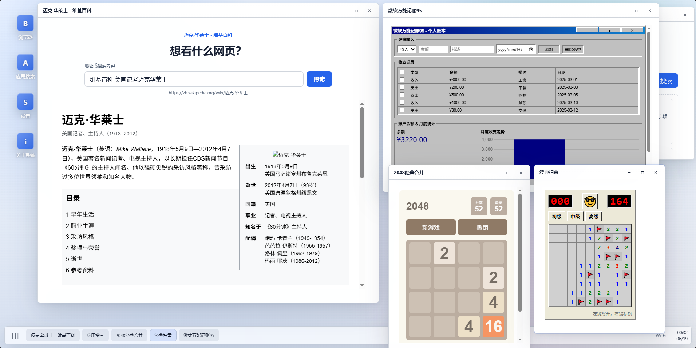

# VibeWebOS

VibeWebOS 是一个运行在浏览器里的桌面系统 MVP，整体体验参考 Windows 11。当前版本包含桌面窗口、任务栏、开始菜单、内置应用、LLM 应用搜索、生成应用窗口和模拟浏览器窗口。

这个项目解决了网上冲浪两大痛点：

1. 现在人们上网时总要考虑看到的页面到底是不是AI生成的🤔，而在这个系统上，答案收敛到了【是】😎
2. 当你想要一个小工具的时候总是找不到现成的😠，而在这个系统里，你只需要在应用搜索功能中输入你要的工具名，然后选择你想要的，过几秒后你就能获得专为你而生成的工具😮（如果你接入的LLM返回得比较快的话）

**注意：这是一个玩具性质的项目#（滑稽）**

灵感来自 : **https://www.youtube.com/live/HG0twQJ7aG4?t=16050**



## 当前能力

- 桌面外壳：任务栏、开始菜单、桌面图标、窗口拖拽、缩放、最小化、最大化和关闭。
- 内置应用：浏览器、应用搜索、设置、关于系统。
- LLM 能力：应用搜索、应用生成、生成应用交互、浏览器导航和浏览器页面交互。
- 生成应用运行时：支持窗口内 HTML、CSS、内联脚本、事件处理属性、HTTPS CDN 脚本、fetch/WebSocket 等浏览器侧能力。
- 安全边界：生成内容运行在 iframe 中，隔离父窗口、桌面外壳、任务栏、开始菜单和其他窗口。
- 窗口级上下文：每个生成应用窗口和浏览器窗口都有独立 LLM 上下文，关闭窗口后立即销毁。

## 项目结构

```text
backend/   FastAPI 后端、DeepSeek 客户端、提示词渲染、响应校验
frontend/  Vue 3 + Pinia + Vite 桌面前端
docs/      设计文档和实施计划
```

## 后端启动

建议使用国内 PyPI 镜像安装依赖：

```powershell
cd backend
python -m venv .venv
.\.venv\Scripts\activate
python -m pip install -r requirements.txt -i https://pypi.tuna.tsinghua.edu.cn/simple
```

首次启动前回到项目根目录，复制环境变量示例文件，并在 `backend/.env` 中填写 API Key：

```powershell
cd ..
copy backend\.env.example backend\.env
```

然后启动后端：

```powershell
cd backend
python -m uvicorn app.main:app --host 127.0.0.1 --port 8000 --reload
```

如果 `8000` 端口被系统策略或其他程序占用，可以换一个端口，例如：

```powershell
python -m uvicorn app.main:app --host 127.0.0.1 --port 8010 --reload
```

健康检查：

```text
http://127.0.0.1:8000/health
```

成功时返回：

```json
{ "status": "ok" }
```

## 运行时配置

非敏感运行时配置位于 `config/app.config.json`。可以按需编辑 `llm.provider`、`llm.baseUrl`、`llm.model`、`llm.requestTimeoutSeconds`、`ui.systemName`、`ui.aboutText`、`ui.waitingTexts` 和 `ui.waitingTextSwitchDelayMs`。

API Key 不能写入 `config/app.config.json`。复制 `backend/.env.example` 到 `backend/.env` 后，`backend/.env` 只应包含：

```env
LLM_API_KEY=
```

复杂生成应用如果出现请求超时，可以在 `config/app.config.json` 中调大 `llm.requestTimeoutSeconds`。

前端 UI 文案通过 UI-only artifact/sync script 消费 UI 配置；不要在前端业务代码中直接 import 根配置 JSON，以免把后端 LLM 配置误带进前端。

## 前端启动

建议使用国内 npm 镜像安装依赖：

```powershell
cd frontend
npm install --registry=https://registry.npmmirror.com
npm run dev
```

打开：

```text
http://127.0.0.1:5173
```

Vite 开发服务器默认把 `/api` 请求代理到 `http://127.0.0.1:8000`。

## 测试命令

前端：

```powershell
cd frontend
npm run lint
npm test
npm run typecheck
npm run build
```

后端：

```powershell
cd backend
.\.venv\Scripts\python.exe -m pytest tests
```

## 验收记录

MVP 手工验收记录见 [docs/验收记录.md](docs/验收记录.md)。

## LLM 上下文策略

每个打开的生成应用窗口、浏览器窗口都维护独立的窗口级 LLM 上下文。上下文只存在于当前页面会话中，不做持久化保存。窗口关闭后，对应上下文立即销毁。不同窗口之间的上下文互不共享，避免多窗口内容互相污染。

每个窗口只保存少量当前工作状态：

- 当前 HTML
- 当前摘要
- 当前表单临时值
- 最近若干次交互摘要

窗口上下文不保存完整历史对话。普通生成应用控件应优先使用本地 JavaScript 或 CDN 前端库处理；只有明确标记为需要 LLM 的控件，才会触发后端 LLM 请求。
